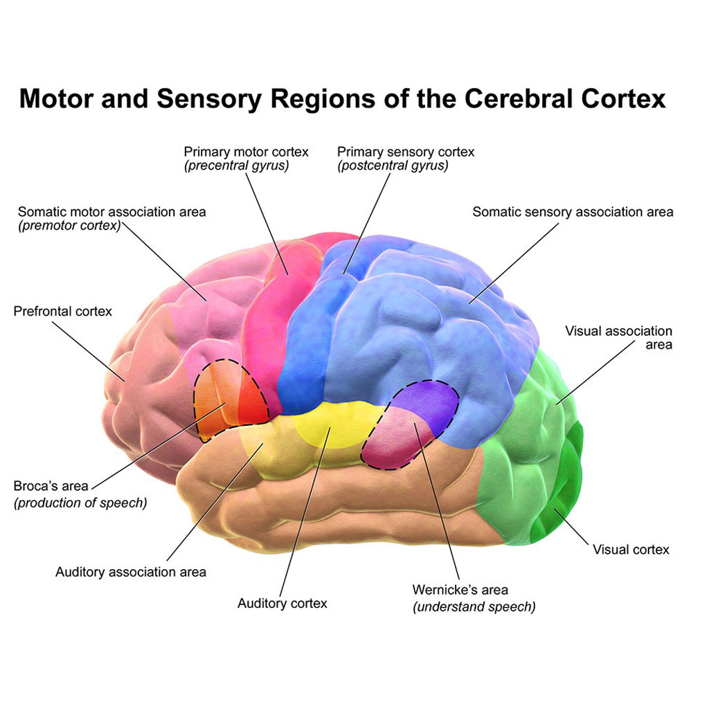

# Primary Function of Neuralink

Status: In progress
Project: Adrian’s Blog (https://www.notion.so/Adrian-s-Blog-a567e68887e84a398b9da2ac781add13?pvs=21)
Parent-task: Neuralink and EMR/ mkultra Article   (Neuralink%20and%20EMR%20mkultra%20Article%2021a8fedc7da340748daa5698bd4b08b8.md)
Task ID: KIH-70

## Description

- [https://youtu.be/xv2_F4FwFiM?si=oBpCZe8qs3xo58dD](https://youtu.be/xv2_F4FwFiM?si=oBpCZe8qs3xo58dD)
- The foundation of a neural cortex is for sight
    - [https://youtu.be/xv2_F4FwFiM?si=oBpCZe8qs3xo58dD](https://youtu.be/xv2_F4FwFiM?si=oBpCZe8qs3xo58dD)
- Completely automated expert supervised Non-invasive surgical implant on minor nerve electrode receptors on top of skull
- Can be removed after surgery
- [https://youtu.be/JjHAN5ersDo?si=OROjrQMhCgsKot8](https://youtu.be/JjHAN5ersDo?si=OROjrQMhCgsKot8-)
    
    